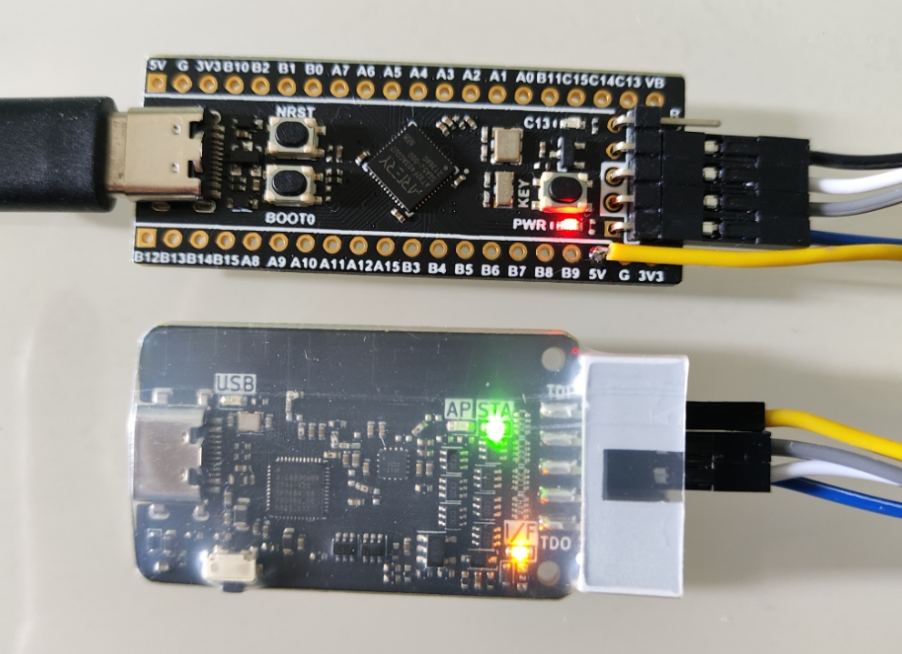

# 无线ICP（在电路编程）

**`版权声明：转载需注明来自于 vllogic.com `**

## 引言
* 在工业现场维护工作中，可能出现固件更新需求，如果没有在开发阶段准备`IAP`/`OTA`接口，就只能通过芯片厂预留的`ICP`/`ISP`接口进行更新。
* 考虑到工业现场常常空间受限，环境不佳，通过`Vllink`系列无线调试器可降低维护工作强度，在预留接口的情况下，仅需接上远端调试器即可完成目标板与计算机的连接。
* 本文将以`AT32F403AxG`为例，阐述无线ICP过程。

## 硬件连接
* 推荐使用`3.7V-5.2V`为远端调试器供电
* 若仅有`3.3V`，其来源务必为DCDC或输出能力大于500mA的大电流大封装LDO，且`5V`及`GND`需用高质量连接线
* 目标板接线
  
   ```
   如上图所示，进行了如下连接：
   远端 ---  AT32F403A
   5V   ---  5V
   GND  ---  GND
   TMS  ---  SWDIO
   TCK  ---  SWCLK
   VRef ---  3V3
   ```
* 计算机端，将另一个黑尾调试器通过USB接上即可

## 编程软件准备
* 通过搜索发现雅特力提供了[定制OpenOCD](https://github.com/ArteryTek/openocd)
* 但其最新[Actions](https://github.com/ArteryTek/openocd/actions/runs/7520365309)中的Artifacts已无法下载
* 这种情况可以通过Fork，手动触发一次构建
* 本人Fork后构建的[二进制](https://github.com/vllogic/ArteryTek_openocd/releases/tag/20240509)

## 无线ICP过程
1. 下载上文中的二进制包，解压后，进入`openocd-windows-x64\bin`目录
2. 本人无AT32F403A工程，故通过HxD工具生成了一份128KB的随机数据Bin文件测试
3. 将测试文件`test128k.bin`拷贝至`openocd-windows-x64\bin`目录
4. 目录下，Shift + 鼠标右键，打开PowerShell
5. 执行命令：
   ```
   ./openocd -f interface/cmsis-dap.cfg -f target/at32f403xG.cfg -c "transport select swd; program test128k.bin verify exit 0x08000000"
   ```
6. 输出如下：
   ```
   Open On-Chip Debugger 0.11.0+dev-g66740f9-dirty (2024-05-08-23:53)
   Licensed under GNU GPL v2
   For bug reports, read
         http://openocd.org/doc/doxygen/bugs.html
   Info : auto-selecting first available session transport "swd". To override use 'transport select <transport>'.
   Info : flash reg address: 0x0, usd addr:  0x0
   Info : flash reg address: 0x0, usd addr:  0x0
   Info : DEPRECATED target event trace-config; use TPIU events {pre,post}-{enable,disable}
   Warn : Transport "swd" was already selected
   Info : Using CMSIS-DAPv2 interface with VID:PID=0x1209:0x6666, serial=Vllink.Basic2.5DEA1FD276
   Info : CMSIS-DAP: SWD supported
   Info : CMSIS-DAP: JTAG supported
   Info : CMSIS-DAP: SWO-UART supported
   Info : CMSIS-DAP: Atomic commands supported
   Info : CMSIS-DAP: Test domain timer supported
   Info : CMSIS-DAP: FW Version = 0254
   Info : CMSIS-DAP: Serial# = Vllink.Basic2.B2B0A8AF76
   Info : CMSIS-DAP: Interface Initialised (SWD)
   Info : SWCLK/TCK = 0 SWDIO/TMS = 0 TDI = 0 TDO = 0 nTRST = 1 nRESET = 1
   Info : CMSIS-DAP: Interface ready
   Info : clock speed 5000 kHz
   Info : SWD DPIDR 0x2ba01477
   Info : [at32f403xx.cpu] Cortex-M4 r0p1 processor detected
   Info : [at32f403xx.cpu] target has 6 breakpoints, 4 watchpoints
   DEPRECATED! use 'read_memory' not 'mem2array'
   Warn : DEPRECATED! (C:/Users/talpa/AppData/Roaming/OpenOCD/mem_helper.tcl:37) use 'expr { (0x307 & ~0) | 0x00000307 }' not 'expr (0x307 & ~0) | 0x00000307'
   Info : starting gdb server for at32f403xx.cpu on 3333
   Info : Listening on port 3333 for gdb connections
   DEPRECATED! use 'read_memory' not 'mem2array'
   Warn : DEPRECATED! (C:/Users/talpa/AppData/Roaming/OpenOCD/mem_helper.tcl:37) use 'expr { (0x307 & ~0) | 0x00000307 }' not 'expr (0x307 & ~0) | 0x00000307'
   target halted due to debug-request, current mode: Thread
   xPSR: 0x01000000 pc: 0x080001f8 msp: 0x200006a0
   ** Programming Started **
   Info : This is target at32f403axx algorithm
   Info : main flash size: 0x100000, sector num:  0x100, sector size: 0x800,  bank size: 0x80000
   Info : This is target at32f403axx algorithm
   Info : main flash size: 0x100000, sector num:  0x100, sector size: 0x800,  bank size: 0x80000
   Info : This is target at32f403axx algorithm
   Info : main flash size: 0x100000, sector num:  0x100, sector size: 0x800,  bank size: 0x80000
   Info : Earse first sector = 0x0, last sector = 0x3f
   Info : Write address = 0x8000000, count: 0x20000
   ** Programming Finished **
   ** Verify Started **
   ** Verified OK **
   shutdown command invoked
   ```
7. 观察到`Verified OK`，ICP更新成功
8. OpenOCD更多信息可参看[OpenOCD User’s Guide](https://openocd.org/doc/html/index.html)及[Flash-Commands.html#program](https://openocd.org/doc/html/Flash-Commands.html#program)。

## 补充
* 对于批量ICP操作，可通过脚本周期性探测目标芯片，在探测成功后执行ICP命令，实现自动化
* 此方案亦可用于现场调试，配合任何支持`CMSIS-DAP V1/V2`协议的调试软件
