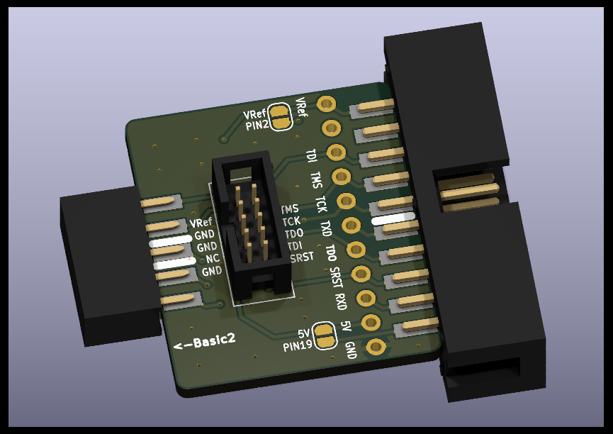
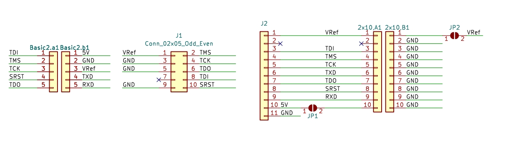
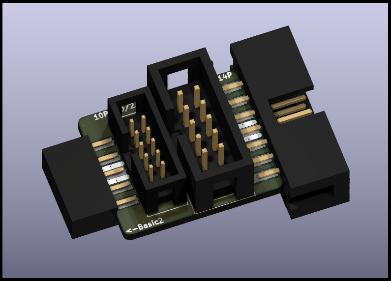
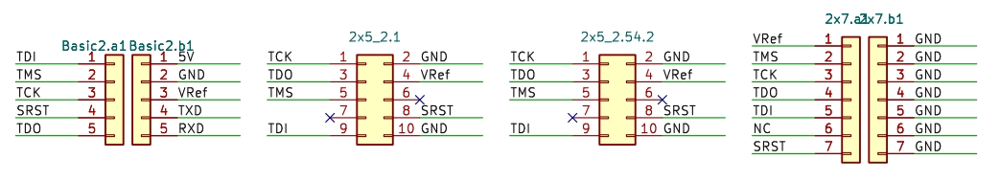
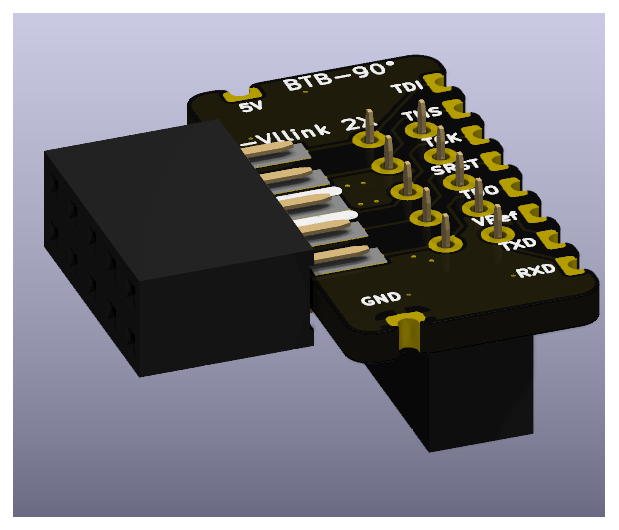
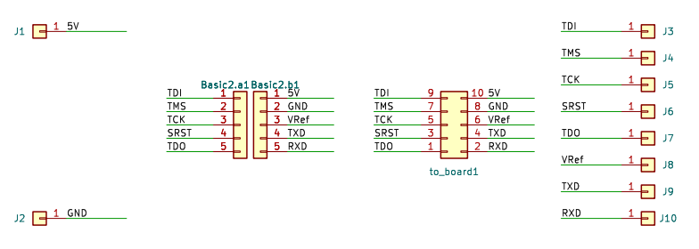
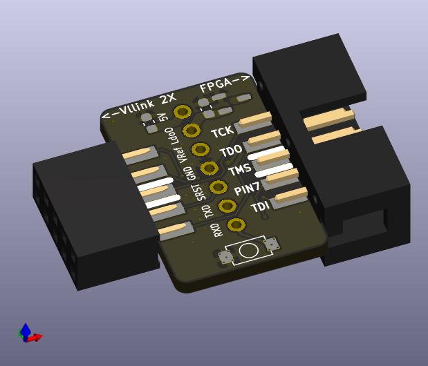
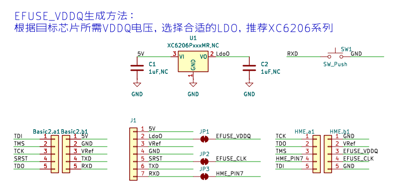

# 转接板资料

## 一、MINI-10P及JTAG-20P转接板
> 
* 从左到右依次为：
  1. FC3公头，支持`Vllink 2X`、`Vllink Basic2`、`Vllink Box2`及、`Vllink Basic`
  2. MIPI-10P 1.27mm 牛角座
  3. [预留]11P 2.54mm 排针
  4. JTAG-20P 2.54mm 牛角座，其`PIN2`与`PIN19`默认悬空，可通过短接点连接对应电源
* 原理图：
  
* 全套设计文件：[interface_basic2_mipi10p_jtag20p.zip](../_static/pcbs/interface_basic2_mipi10p_jtag20p.zip)

## 二、FPGA通用转接板
> 
* 从左到右依次为：
  1. FC3公头，支持`Vllink 2X`、`Vllink Basic2`
  2. 10P 2.00 JTAG牛角座
  3. 10P 2.54 JTAG牛角座
  4. 14P 2.54 JTAG牛角座
* 原理图：
  
* 全套设计文件：[interface_basic2_to_fpga.zip](../_static/pcbs/interface_basic2_to_fpga.zip)
* 建议：对接FPGA使用前，配置`Vref_Voltage_mV=0`与`Vout=disable`

## 三、BTB或90°转接板
> 
* 从左到右依次为：
  1. FC3公头，支持`Vllink 2X`与`Vllink Basic2`
  2. FC3公头，对接底板DC3母座
  3. 周边半孔，可实现底板与调试器的极限扁平连接
* 原理图：
  
* 全套设计文件：[interface_basic2_btb.zip](../_static/pcbs/interface_basic2_btb.zip)

## 四、京微齐力专用转接板
> 
* 从左到右依次为：
  1. FC3公头，支持`Vllink 2X`与`Vllink Basic2`
  2. [预留]7P 2.54mm 排针
  3. DC3母座，兼容京微齐力标准接口
* 原理图：
  
* 全套设计文件：[interface_basic2_hme.zip](../_static/pcbs/interface_basic2_hme.zip)
* 支持通过补焊LDO生成固定电压的`EFUSE_VDDQ`，用于EFuse编程
