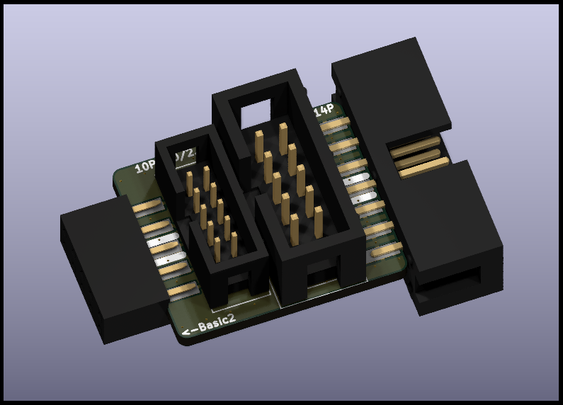
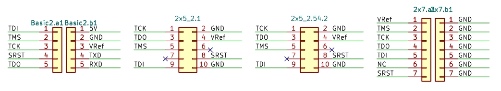

# Basic2配套FPGA接口转接板

## 示意图

* 从左到右依次为：
  1. DC3母座，接上Vllink Basic2调试器
  2. 10P 2.00 JTAG牛角座
  3. 10P 2.54 JTAG牛角座
  4. 14P 2.54 JTAG牛角座

## 原理图

* 原则上，在作为FPGA下载器使用时，务必先将VRef调整至`0V`即外部参考电压模式

## 全套设计文件
* [interface_basic2_to_fpga.zip](../_static/pcbs/interface_basic2_to_fpga.zip)