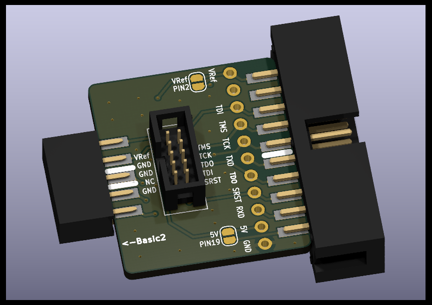
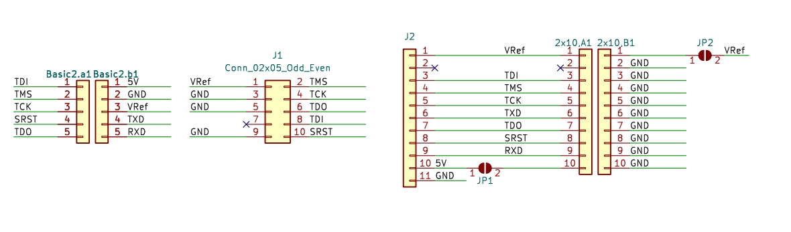

# Vllink Basic2配套MIPI-10P及JTAG-20P转接板

## 示意图

* 从左到右依次为：
  1. DC3母座，接上Vllink Basic2调试器
  2. MIPI-10P 1.27mm 牛角座
  3. [预留]11P 2.54mm 排针
  4. JTAG-20P 2.54mm 牛角座，其`PIN2`与`PIN19`默认悬空，可通过短接点连接对应电源

## 原理图

## 全套设计文件
* [interface_basic2_mipi10p_jtag20p.zip](../_static/pcbs/interface_basic2_mipi10p_jtag20p.zip)