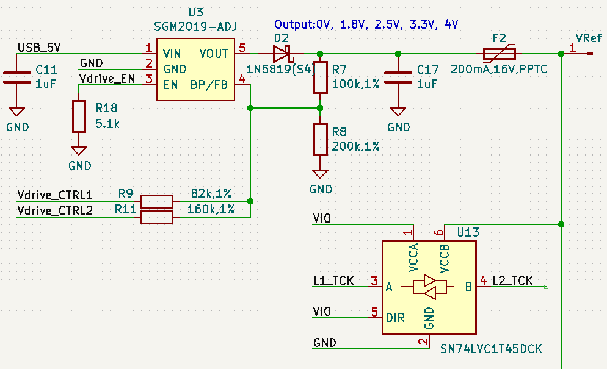

# VRef口使用说明

## Vllink Basic2
### 电路

### 说明
1. `VRef`作为电平转换芯片的B端参考电压，实现逻辑IO的电平转换，支持的输入参考电压范围为：`1.2V-5.5V`
2. `VRef`通过一自恢复保险丝连接简易可调电压源，限制电流200mA
3. 简易可调电压源的输出电压可配置为`0V`、`1.8V`、`2.5V`、`3.3V`以及`4.0V`，其中`0V`即输入模式，其他电压则处于输出模式
4. 简易可调电压源默认为`0V`模式，此时，若将`VRef`悬空，所有逻辑IO将处于高阻输入态，无法进行通讯
5. 在将简易可调电压源配置成非0V时，应当知悉目标板的耐受电压，谨防烧毁目标板
6. 配置工具：[Vllink Web Configure](https://vllogic.com/_static/tools/web_config_basic2/)
