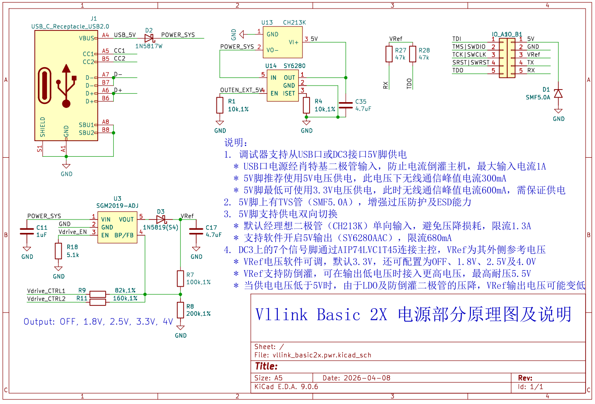

# Vllink Basic 2X 电源部分详细说明

## 电路
* 电路图
   
* [PDF下载](../_static/docs/vllink_basic2x.pwr.pdf)

## 说明
1. 调试器支持从USB口或DC3接口5V脚供电
   * USB口电源经肖特基二极管输入，防止电流倒灌主机，最大输入电流1A
   * 5V脚推荐使用5V电压供电，此电压下无线通信峰值电流300mA
   * 5V脚最低可使用3.3V电压供电，此时无线通信峰值电流600mA，需保证供电
2. 5V脚上有TVS管（SMF5.0A），增强过压防护及ESD能力
3. 5V脚支持供电双向切换
   * 默认经理想二极管（CH213K）单向输入，避免压降损耗，限流1.3A
   * 支持软件开启5V输出（SY6280AAC），限流680mA
4. DC3上的7个信号脚通过AIP74LVC1T45连接主控，VRef为其外侧参考电压
   * VRef电压软件可调，默认3.3V，还可配置为OFF、1.8V、2.5V及4.0V
   * VRef支持防倒灌，可在输出低电压时接入更高电压，最高耐压5.5V
   * 当供电电压低于5V时，由于LDO及防倒灌二极管的压降，VRef输出电压可能变低
