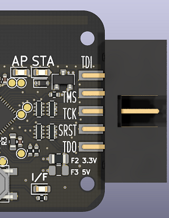
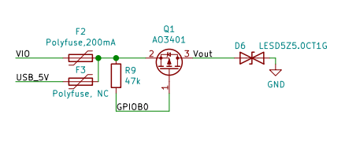

# Vout口使用说明

## Vllink Basic 初代
### 外观

### 电路

* 此版本`Vout`仅支持`3.3V`、`5V`二选一
* 对于`3.3V`版本（贴F2，不贴F3），可通过PMOS管对外输出3.3V电源，此时输出持续电流不应大于100mA
* 对于`5V`版本（贴F3，不贴F2），可通过PMOS管对外输出5V电源。并且，即使`GPIOB0`未拉低，未开启的PMOS也将等效一个二极管，调试器可从`Vout`脚获得电源输入
### 总结
| 功能 | 3.3V版本 | 5V版本 |
| :----: | :----: | :----: |
| 输出3.3V | 支持 | 不支持 |
| 输出5V | 不支持 | 支持 |
| 开发板5V反向供电 | 不支持 | 支持 |
