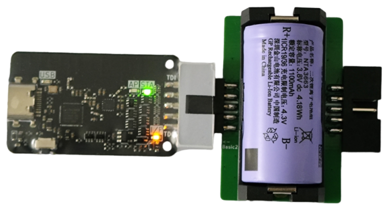
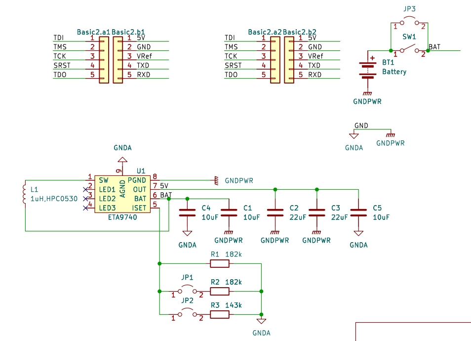

# Vllink锂电池充放一体供电模块

## 功能
* 断开供电后，对调试器及目标板提供5V
* 对接所有电源及信号线
* 支持通过调试器或者开发板5V进行充电（严禁超压使用）

## 适用产品
* Vllink Basic
* Vllink Basic2

## 效果图

## 原理图

## 注意事项
1. 焊接时务必注意两个DC3公母座的朝向与正反，比照效果图处理
2. Bom中的电池座弹簧片非常紧，建议先用鸭嘴钳将弹簧片压扁再装电池
3. 此模块空载时电流约0.08mA，长期不用时建议取下电池或断开电源开关
4. 此模块在断开USB供电时，5V会掉电几秒，故无法作为UPS使用

## 全套设计及生产文件
* [interface_battboard.zip](../_static/pcbs/interface_battboard.20250115.zip)