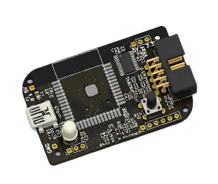

Vllogic 产品使用指南
===================================

快速上手
--------

======================  ======================  ======================
|Vllink Basic|_         |Vllink Sdcard|_        |Vllink Sdcard HME|_
----------------------  ----------------------  ----------------------
`Vllink Basic`_         `Vllink Sdcard`_        `Vllink Sdcard HME`_
======================  ======================  ======================

.. |Vllink Basic| image:: _static/vllink_basic_top_45.png
.. _Vllink Basic: quick/vllink_basic.html

.. _Vllink Sdcard: quick/vllink_sdcard.html

.. |Vllink Sdcard HME| image:: _static/vllink_sdcard_hme_top_45.png
.. _Vllink Sdcard HME: quick/vllink_sdcard_hme.html

.. toctree::
   :caption: 快速上手
   :hidden:

   quick/vllink_basic.md
   quick/vllink_sdcard.md
   quick/vllink_sdcard_hme.md

.. toctree::
   :maxdepth: 1
   :caption: 硬件资料

   hardware/vllink_basic.md
   hardware/vllink_sdcard.md
   hardware/vllink_sdcard_hme.md

.. toctree::
   :maxdepth: 1
   :caption: IDE使用教程

   software/iar.md
   software/keil_mdk.md
   software/probe_rs.md
   software/openocd.md
   software/pyocd.md

===================================

.. toctree::
   :maxdepth: 1
   :caption: 其他
   :hidden:
   
   readme.md

