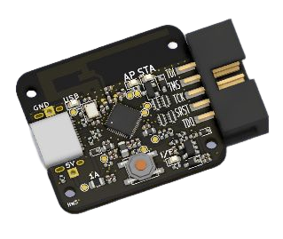
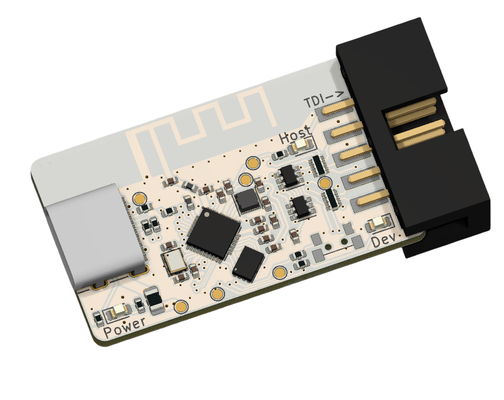
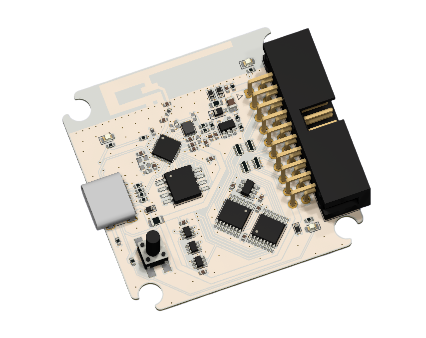
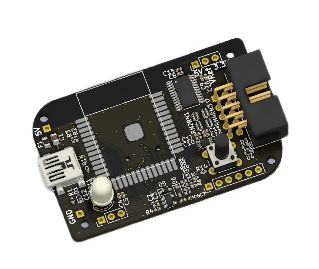

Vllogic 产品使用指南
===================================

相关链接
--------
淘宝：https://vllogic.taobao.com/

Github：https://github.com/vllogic

Discussions：https://github.com/vllogic/vllogic.github.io/discussions

QQ群：791104674

快速上手
--------

======================  ======================  ======================
|Vllink Basic|_         |Vllink Pro|_           |Vllink Hercules|_
----------------------  ----------------------  ----------------------
`Vllink Basic`_         `Vllink Pro`_           `Vllink Hercules`_
======================  ======================  ======================
|Vllink Basic2|_
----------------------  ----------------------  ----------------------
`Vllink Basic2`_
======================  ======================  ======================

.. _Vllink Basic: quick/vllink_basic.html

.. _Vllink Basic2: quick/vllink_basic2.html

.. _Vllink Pro: quick/vllink_pro.html

.. _Vllink Hercules: quick/vllink_hercules.html

.. toctree::
   :caption: 快速上手
   :hidden:

   quick/vllink_basic.md
   quick/vllink_basic2.md
   quick/vllink_pro.md
   quick/vllink_hercules.md

.. toctree::
   :maxdepth: 1
   :caption: 硬件资料

   hardware/vllink_basic_vout.md

.. toctree::
   :maxdepth: 1
   :caption: 固件更新

   update/vllink_basic.md
   update/vllink_basic2.md
   update/vllink_pro.md
   update/vllink_hercules.md

.. toctree::
   :maxdepth: 1
   :caption: 开发工具使用说明

   software/tools.md
   software/windows7_driver.md
   software/iar.md
   software/keil_mdk.md
   software/probe_rs.md
   software/openocd.md
   software/pyocd.md
   software/freemaster.md
   software/hercuels_online_programmer.md
   software/hercules_offline_programmer.md

===================================

.. toctree::
   :maxdepth: 1
   :caption: 其他
   :hidden:
   
   readme.md

