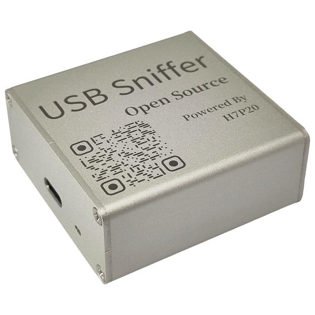
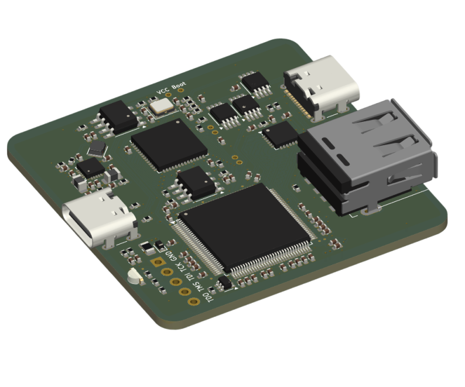
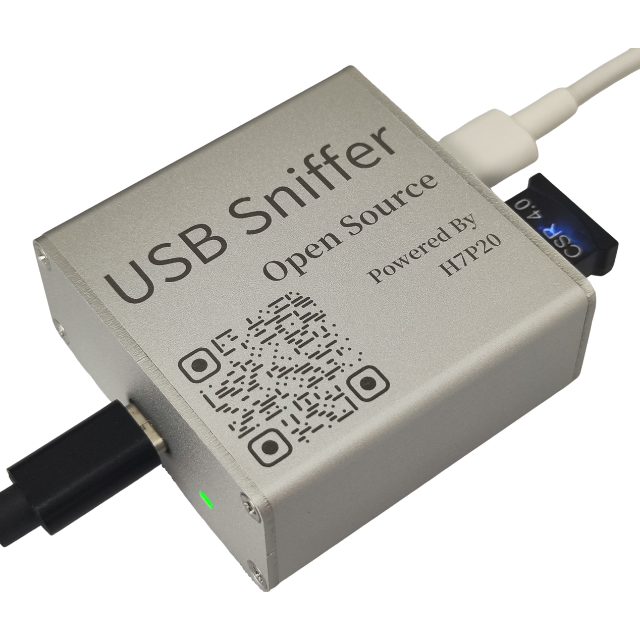

# USB Sniffer H7P20 快速上手

## 一、简介
|铝合金外壳|PCBA 3D|
|:--:|:--:|
|||

&emsp;&emsp;本产品为USB协议分析工具，可配合 [Wireshark](https://www.wireshark.org/) 进行实时协议解析，支持`USB低速`、`USB全速`及`USB高速`。

&emsp;&emsp;软硬件基于 [ataradov.usb-sniffer](https://github.com/ataradov/usb-sniffer) 复刻，并继续以`BSD-3-Clause license`协议开源。核心变动是将其`Lattice LCMXO2`替换为`HME H7P20`。

&emsp;&emsp;所有生产设计料全部开源，如下：
* [PCB图纸](https://github.com/vllogic/dalishen_pi_h7p20/tree/main/hardware/usb_sniffer_h7p20)
* [FPGA代码](https://github.com/vllogic/dalishen_pi_h7p20/tree/main/examples/usb_sniffer_h7p20.ataradov.usb_sniffer)
* [上位机代码](https://github.com/vllogic/ataradov.usb-sniffer)
* [铝合金外壳](TODO)

## 二、快速上手
### 2.1 资源整合包
* [下载源一：百度网盘](https://pan.baidu.com/s/556fYdWR6jrxaBPkiDgI36w)
* [下载源二：Github Release](https://github.com/vllogic/ataradov.usb-sniffer/releases)
### 2.2 软件安装
* **方法一：解包即用**
    1. 解压整合包中的`WiresharkPortable64_4.4.9.paf.zip`
    2. 文件夹`WiresharkPortable64_4.4.9.paf`下的`WiresharkPortable64.exe`即为捕获软件
* **方法二：逐步安装**
    1. 安装整合包中的`Wireshark-4.4.9-x64.exe`，或从 [Wireshark官网](https://www.wireshark.org/) 下载最新版安装
    2. 启动`Wireshark`，点击`帮助`-`关于Wireshark`-`文件夹`，打开`Global Extcap path`文件夹，将整合包中的`usb_sniffer_win.exe`拷贝至此文件夹中，该插件亦可通过 [源码](https://github.com/vllogic/ataradov.usb-sniffer/tree/main/software) 自行构建
    3. 重启`Wireshark`，确保插件被载入
### 2.3 Wireshark捕获
|接线示例，图中黑线接`Wireshark`主机，白线接`采集对象母口`，蓝牙狗为`采集对象设备`|
|:--:|
||
1. 使用附件中的较长的编织线连接`Wireshark`主机`推荐主板上的USB3.0母口`与`分析仪带灯一侧TYPE-C口`
2. 使用附件中较短的屏蔽线连接`采集对象母口`与`分析仪无灯一侧TYPE-C口`
2. 启动`Wireshark`，在`捕获`中会出现一个`USB Sniffer`，点击其齿轮，根据目标设备速度选择`采集速度`，推荐勾选`Fold empty frames(折叠空帧)`，点击开始
3. 硬件的另一端，`TYPE-C口`常用于连接USB主机，`A母`常用于连接USB设备，二者也可以反过来连接
4. 在目标USB通讯开始后，Wireshark中会显示捕获到的数据
### 2.4 Wireshark分析

### 2.6 Wireshark分析示例
1. `高速`U盘
    * [sniffer_hs_USBFlashDisk.pcapng](../_static/docs/sniffer_hs_USBFlashDisk.pcapng.zip)
2. `高速`Vllink Basic2调试器
    * [sniffer_hs_VllinkBasic2.pcapng](../_static/docs/sniffer_hs_VllinkBasic2.pcapng.zip)
3. `全速`CSR 4.0 蓝牙狗
    * [sniffer_fs_csr4.0.pcapng](../_static/docs/sniffer_fs_csr4.0.pcapng.zip)
4. `全速`游戏手柄
    * [sniffer_fs_gamepad.pcapng](../_static/docs/sniffer_fs_gamepad.pcapng.zip)

## 三、常见问题
1. * 问：推荐连接方法
   * 答：推荐使用附件中较长的编织线连接电脑`主板上3.0母口`与`分析仪单TYPE-C口`；使用附件中较短的屏蔽线连接`采集对象母口`与`分析仪`
2. * 问：捕获时能否自动识别速度，无需提前选定速度模式
   * 答：原作者未实现此项功能，本产品也不支持
3. * 问：能否支持[USB PACKET VIEW](https://www.usbpacketviewer.com/download/)
   * 答：不支持实时捕获，但可以导入分析，详见此网站第九章[hellofpga.com_usb-sniffer](http://www.hellofpga.com/index.php/2025/04/03/usb-sniffer/)

## 四、二次开发
### 4.1 CY7A68013A部分
* [源码](https://github.com/vllogic/ataradov.usb-sniffer/tree/main/firmware)
* 如何进入Boot：短接PCB上CY7A68013A芯片旁的`Boot`与`VCC`，再连接电脑，即可进行二次编程

### 4.2 H7P20部分
* [源码](https://github.com/vllogic/dalishen_pi_h7p20/tree/main/examples/usb_sniffer_h7p20.ataradov.usb_sniffer)
* 更多开发资料请参考 [大力神派](./dalishen_pi_h7p20.md)

## 五、交流群
* QQ群：635683631
