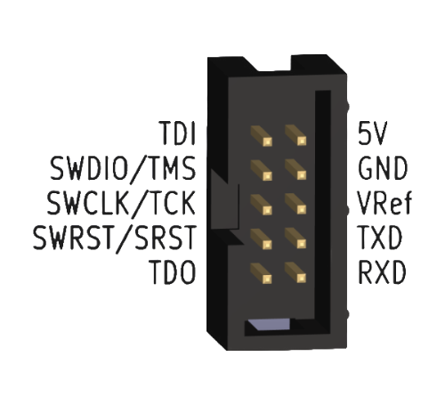

# Vllink 2X 快速上手

## 一、对比
* `Vllink 2X`固件与`Basic 2`通用
* `Vllink 2X`硬件部分做了如下优化：
  | 硬件对比 | Vllink Basic 2 | Vllink 2X |
  | :--- | :--- | :--- |
  | 外壳 | 热缩管 | **塑料外壳+PVC标签** |
  | 独立蓝牙天线 | 预留 | 无 |
  | 2.4G Wifi天线 | 无 | **支持2.4G信道** |
  | 5.8G Ipex4接口 | 无 | **支持，可手工切换** |
  | 红色LED灯 | **有** | 无 |
  | USB电源输入单向二极管 (1N5817W) | 无 | **有** |
  | DC3 5V输入理想二极管 (CH213K) | 无 | **有** |
  | DC3 5V输出功率电子开关 (SY6280) | 无 | **有，软件控制** |
  | DC3 5V脚TVS (SMF5.0A) | 无 | **有** |

## 二、调试接口定义

| 接口 | 介绍 |
| :---- | :---- |
| TDI  | JTAG数据口 |
| TMS / SWDIO  | JTAG模式口、SWD数据口 |
| TCK / SWCLK  | JTAG时钟口、SWD时钟口 |
| SRST / SWRST  | 芯片复位口 |
| TDO  | JTAG数据口 |
| 5V  | 双向5V电源口1 |
| GND  | 共地口 |
| VRef  | 参考电平及简易可调电压源2 |
| TXD  | 串口输出 |
| RXD  | 串口输入 |

  [1] `5V`脚支持供电双向切换，默认经理想二极管（CH213K）单向输入，支持软件开启5V输出。详见[Vllink 2X 电源部分详细说明](../hardware/vllink_2x_pwr.md)

  [2] `VRef`默认输出3.3V，可配置为输入模式或输出其他电压。详见[Vllink 2X 电源部分详细说明](../hardware/vllink_2x_pwr.md)

## 三、TODO
