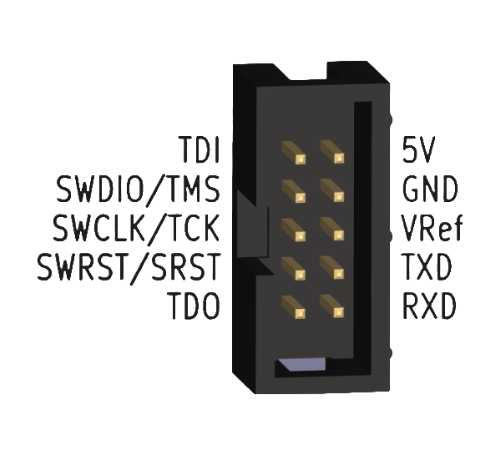
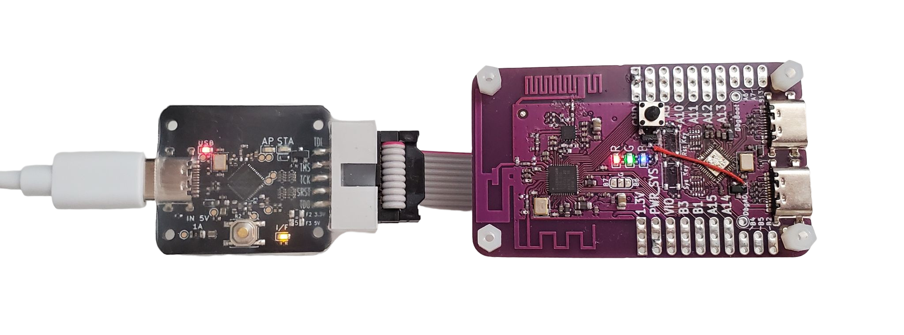
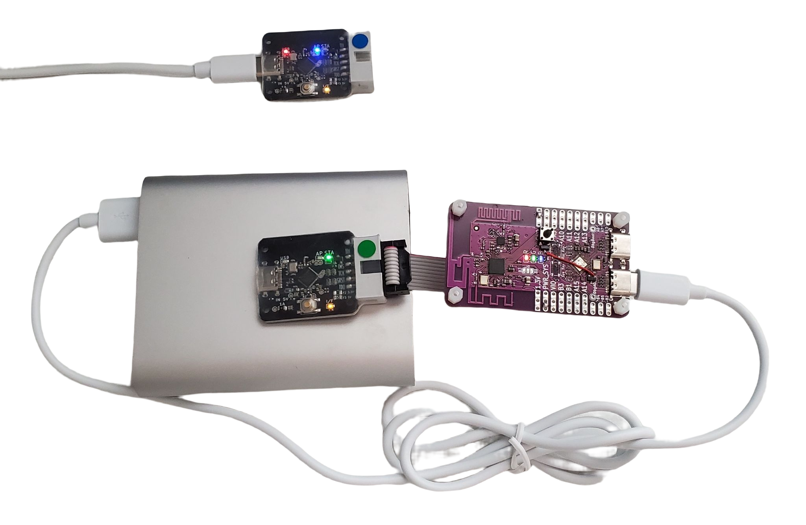
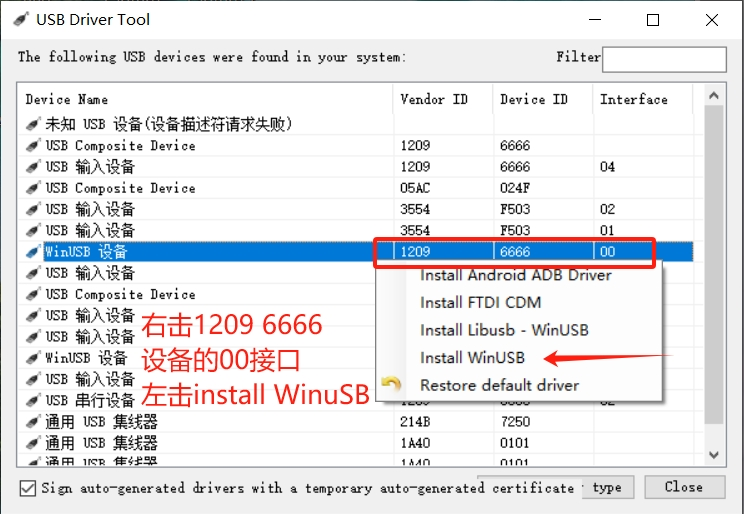

# Vllink Basic2 快速上手

## 调试接口定义

| 接口 | 介绍 |
| :---- | :---- |
| TDI  | JTAG数据口 |
| TMS / SWDIO  | JTAG模式口、SWD数据口 |
| TCK / SWCLK  | JTAG时钟口、SWD时钟口 |
| SRST / SWRST  | 芯片复位口 |
| TDO  | JTAG数据口 |
| 5V  | 双向5V电源口<sup>1</sup> |
| GND  | 共地口 |
| VRef  | 参考电平及简易可调电压源<sup>2</sup> |
| TXD  | 串口输出 |
| RXD  | 串口输入 |

  [1] [5V口详细说明](../hardware/vllink_basic2_5v.md)
  [2] [VRef口详细说明](../hardware/vllink_basic2_vref.md)

## 模式介绍及切换
### 模式切换
* 可通过双击按键切换运行模式
* 基本模式有三种，分别是有线模式、无线接收模式（AP）以及无线发送模式（STA）

### 有线模式
* 板上红灯、黄灯亮起
* USB设备启用，可与计算机通信
* 调试口可连接目标板

### 无线接收模式（AP）
* 板上红灯、黄灯亮起，板上蓝灯作为连接指示状态灯，未连接时闪烁、已连接后常亮
* USB设备启用，可与计算机通信
* 注意：若在蓝灯闪烁时，启动调试、CDC串口功能，将会启用板上调试口，而非远端调试口。

### 无线发送模式（STA）
* 板上黄灯亮起，板上绿灯作为连接指示状态灯，未连接时闪烁、已连接后常亮
* USB设备关闭，不可与计算机通信

### 有线模式连接示例

* 图中调试器为第一代，`Basic2`版本连接方式相同
* 图中调试器为有线模式，USB接计算机，调试口接目标板

### 无线模式连接示例
#### 1. STA为目标板供电

* 图中调试器为第一代，`Basic2`版本连接方式相同
* 图中调试器一个为AP模式，不接目标板；另一个为STA模式，USB接电源、调试口接目标板

#### 2. 目标板为STA供电

* 图中调试器为第一代，`Basic2`版本连接方式相同
* 图中调试器一个为AP模式，不接目标板；另一个为STA模式，调试口接目标板

## 配置工具
  * 链接：[基础配置](https://vllogic.com/_static/tools/web_config_basic2/)
  * 使用说明：
    ```
    1. 使用Chrome内核浏览器打开上述链接
    2. 连接调试器
    3. 点击“Connect Vllink”
    4. 在小弹窗中选中DAP，点击连接
    5. 连接后，上面的常规设置文本即可修改，修改后需要点击“同步设置”保存，注意无效的配置将在同步时被清除
    ```
  * 注意：当电脑端所连的调试器为AP模式，且已连接远端STA，则此工具将读写远端STA的配置。
  * 恢复出厂设置：
    ```
    1. 使用Chrome内核浏览器打开上述链接
    2. 连接调试器
    3. 点击“Connect Vllink”
    4. 在小弹窗中选中DAP，点击连接
    5. 连接后，删除设置中每一行'='后的文本
    6. 点击“同步设置”保存，重新上电
    ```
## 注意事项
1. 调试口逻辑电平由`VRef`决定，建议由开发板提供；若将`VRef`改为输出模式，应与目标板逻辑电平一致
2. 升级程序需要使用支持WebUSB的操作系统及浏览器，如Windows10及Chrome内核浏览器
3. Windows7系统用户请参考下方链接安装驱动

## 常见问题
1. * 问：能识别`CMSIS-DAP V1`，但`CMSIS-DAP V2`接口消失
   * 答：下载修复工具：[UsbDriverTool](../_static/tools/UsbDriverTool-2.1.zip)，解压运行`UsbDriverTool.exe`，参照下图修复
   
2. * 问：设备管理器内能发现`CMSIS-DAP V2`设备，但是软件却无法访问
   * 答：在设备管理器内，右击`CMSIS-DAP V2`设备，卸载设备，然后重新连接一次
3. * 问：Keil内`Reset and Run`功能无效，即按`F8`下载程序后，程序未自动运行
   * 答：在`Debug`-`CMSIS-DAP - JTAG/SW Adapter`中，选定`CMSIS-DAP v2`即可

## 开发工具使用说明
* [Windows7 驱动安装](../software/windows7_driver.md)
* [IAR 使用说明](../software/iar.md)
* [Keil MDK 使用说明](../software/keil_mdk.md)
* [Probe RS 使用说明](../software/probe_rs.md)
* [OpenOCD 使用说明](../software/openocd.md)
* [PyOCD 使用说明](../software/pyocd.md)
* [FreeMASTER 使用说明](../software/freemaster.md)

## 进阶使用
### FPGA下载器
* [转接板资料](../hardware/vllink_basic2_to_fpga.md)
### MIPI-10及JTAG-20P转接板
* [转接板资料](../hardware/vllink_basic2_to_mipi10p_jtag20p.md)

## 其他
* [A4上手指南](../_static/docs/vllink_basic2.A4上手指南.pdf)
