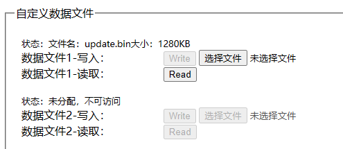

# Vllink Hercules 快速上手

Vllink Hercules是为[京微齐力](http://www.hercules-micro.com/)定制的编程、调试工具

## 一、调试接口定义

| 接口 | 介绍 |
| :---- | :---- |
| TCK  | JTAG时钟口 |
| TDO  | JTAG数据口 |
| TMS  | JTAG模式口 |
| NC | 未连接 |
| TDI  | JTAG数据口 |
| GND  | 共地口 |
| VRef  | 参考电压输入口 |
| EFUSE_VDDQ  | EFuse编程电压输出口 |
| EFUSE_CLK  | EFuse编程时钟输出口 |
| GND  | 共地口 |

## 二、功能简述
### 2.1 Hercules标准下载
* [开发中]此接口协议兼容旧款`68013方案`下载器，可对接原厂`Fuxi`开发工具使用
### 2.2 快速在线下载
* 此接口用于实现下载提速，支持Flash读写、Chip写等功能
* [在线下载](https://vllogic.com/_static/tools/web_download_hercules/)，注意，此网页工具需要使用支持`WebUSB`的浏览器打开，如`Edge`
### 2.3 离线编程器
* 此调试器可用于对Hercules芯片离线编程，包括Flash及Efuse
* 离线编程通过[通用配置](https://vllogic.com/_static/tools/web_config/)进行配置
* 支持手动烧录、自动烧录、数量限制、配置数据保护等特性

## 三、固件升级及恢复默认设置
### 3.1 固件升级
* 请访问[Vllink Hercules 固件更新](../update/vllink_hercules.md)
### 3.2 恢复默认设置
在调试器出现异常情况时，可通过以下操作恢复正常功能
1. 参考`3.1`确认已升级至最新固件
2. 打开[通用配置](https://vllogic.com/_static/tools/web_config/)
3. 点击`Connect Vllink`，在对话框中选中设备并点击`连接`
4. 将以下文本覆盖到`文本->常规设置`栏下
    ```
    MODE=
    Mode_Quick_Switch=
    Vout=
    Vout_Key_Reset=
    Vout_Voltage_mV=
    CDC_Shell=
    Dap_Resp_Overtime_Discard=
    Srst_Clear_Attach_Write=
    Mac_Addr=
    Wireless_ATTR=
    Wireless_Host_Channel=
    Wireless_Host_SSID=
    Wireless_Host_Password=
    ```
5. 将以下文本覆盖到`文本->自定义设置`栏下
    ```
    Customize_Wireless_Host=
    Customize_Wireless_Device=
    Customize_DATA_AREA_SIZE=
    Customize_DATA_FILE1_NAME=
    Customize_DATA_FILE1_ATTR=
    Customize_DATA_FILE1_SIZE=0
    Customize_DATA_FILE2_NAME=
    Customize_DATA_FILE2_ATTR=
    Customize_DATA_FILE2_SIZE=0
    Customize_DATA_FILE3_NAME=
    Customize_DATA_FILE3_ATTR=
    Customize_DATA_FILE3_SIZE=0
    Customize_DATA_FILE4_NAME=
    Customize_DATA_FILE4_ATTR=
    Customize_DATA_FILE4_SIZE=0
    Customize_DATA_FILE5_NAME=
    Customize_DATA_FILE5_ATTR=
    Customize_DATA_FILE5_SIZE=0
    Customize_DATA_FILE6_NAME=
    Customize_DATA_FILE6_ATTR=
    Customize_DATA_FILE6_SIZE=0
    Customize_DATA_FILE7_NAME=
    Customize_DATA_FILE7_ATTR=
    Customize_DATA_FILE7_SIZE=0
    Customize_DATA_FILE8_NAME=
    Customize_DATA_FILE8_ATTR=
    Customize_DATA_FILE8_SIZE=0
    Customize_DATA_FILE9_NAME=
    Customize_DATA_FILE9_ATTR=
    Customize_DATA_FILE9_SIZE=0
    Customize_CMD_INIT=
    Customize_CMD_POLL=
    ```
6. 点击`同步设置`
7. 对调试器重新上电，恢复默认设置完成

## 四、快速在线下载使用说明
### 4.1 准备工作
1. 使用支持`WebUSB`的浏览器打开[在线下载](https://vllogic.com/_static/tools/web_download_hercules/)
2. 调试器连接电脑，调试器通过牛角排线连接开发板
3. 开发板上电
### 4.2 软件说明
* 在线下载界面如下：
  
* 连接调试器：点击`Connect Vllink Hercules`，在对话框中选中设备并点击`连接`
* 连接后，`Chip Info`区域会显示当前开发板芯片类型，Flash容量
* `Chip Info`区域中的`Auto Probe`默认勾选，此选项会使调试器持续与开发板通讯，检测开发板状态
* `Flash Download`区域用于Flash下载，支持`bin`及`acf`格式的文件
* `Flash Read`区域用于Flash全片读取
* `Chip Download`区域用于Chip下载，下载完成后会自动运行，一般用于开发阶段快速运行码流，重新上电后此码流丢弃
### 4.3 示例 HME-H3
1. 根据`4.1`完成准备工作，参考`4.2`完成连接，`Chip Info`区域出现H3芯片信息
2. `Flash Download`：选择需要烧录的固件，再点击Update，进度条跑完后即完成下载
3. `Flash Download`->`Auto Run`：勾选此项将在下载完成后，自动运行所下载的固件
4. `Flash Read`：点击`Save`，会将芯片中的Flash数据下载出来
5. `Chip Download`：
6. 由于调试器连接目标芯片会导致芯片暂停，故在使能`Auto Run`的下载完成或`Chip Download`完成之后，调试器将停止自动探测开发板。如需再次执行操作，请勾选`Auto Probe`，或手动点击`Probe`按钮
### 4.4 示例 HME-H1C02
1. 根据`4.1`完成准备工作，参考`4.2`完成连接，`Chip Info`区域出现H1C02芯片信息
2. `Flash Download`：选择需要烧录的固件，再点击Update，进度条跑完后即完成下载
3. `Flash Download`->`Auto Run`：勾选此项将在下载完成后，自动运行所下载的固件
4. `Flash Read`：点击`Save`，会将芯片中的Flash数据下载出来
5. `Chip Download`：
6. 由于调试器连接目标芯片会导致芯片暂停，故在使能`Auto Run`的下载完成或`Chip Download`完成之后，调试器将停止自动探测开发板。如需再次执行操作，请勾选`Auto Probe`，或手动点击`Probe`按钮
### 4.5 示例 HME-HR02
1. 根据`4.1`完成准备工作，参考`4.2`完成连接，`Chip Info`区域出现HR02芯片信息
2. `Flash Download`：选择需要烧录的固件，再点击Update，进度条跑完后即完成下载
3. `Flash Download`->`Auto Run`：勾选此项将在下载完成后，自动运行所下载的固件
4. `Flash Read`：点击`Save`，会将芯片中的Flash数据下载出来
5. `Chip Download`：
6. 由于调试器连接目标芯片会导致芯片暂停，故在使能`Auto Run`的下载完成或`Chip Download`完成之后，调试器将停止自动探测开发板。如需再次执行操作，请勾选`Auto Probe`，或手动点击`Probe`按钮
### 4.6 示例 HME-M5
1. 根据`4.1`完成准备工作，参考`4.2`完成连接，`Chip Info`区域出现M5芯片信息
2. `Flash Download`：选择需要烧录的固件，再点击Update，进度条跑完后即完成下载
3. `Flash Download`->`Auto Run`：勾选此项将在下载完成后，自动运行所下载的固件
4. `Flash Read`：点击`Save`，会将芯片中的Flash数据下载出来
5. `Chip Download`：
6. 由于调试器连接目标芯片会导致芯片暂停，故在使能`Auto Run`的下载完成或`Chip Download`完成之后，调试器将停止自动探测开发板。如需再次执行操作，请勾选`Auto Probe`，或手动点击`Probe`按钮
### 4.7 示例 HME-M7
1. 根据`4.1`完成准备工作，参考`4.2`完成连接，`Chip Info`区域出现M7芯片信息
2. `Flash Download`：选择需要烧录的固件，再点击Update，进度条跑完后即完成下载
3. `Flash Download`->`Auto Run`：勾选此项将在下载完成后，自动运行所下载的固件
4. `Flash Read`：点击`Save`，会将芯片中的Flash数据下载出来
5. `Chip Download`：
6. 由于调试器连接目标芯片会导致芯片暂停，故在使能`Auto Run`的下载完成或`Chip Download`完成之后，调试器将停止自动探测开发板。如需再次执行操作，请勾选`Auto Probe`，或手动点击`Probe`按钮

## 五、离线编程器配置说明
### 5.1 提示
* **离线编程器的使用较为繁琐，请在充分阅读本说明后进行配置，如遇到异常问题，请联系上游工程师。**
* 如果是第一次使用，请先参考`3.2`恢复出厂设置，然后按照下文中的示例进行一次测试，测试成功后再按照预想功能调整配置。
### 5.2 准备工作-配置
1. 使用支持`WebUSB`的浏览器打开[通用配置](https://vllogic.com/_static/tools/web_config/)
2. 调试器连接电脑
### 5.3 软件说明-总览
* 配置网页界面如下：
  
* `Status`：可以视为软件运行Log，用于排查异常情况
* `安全配置`：用于限制配置功能的访问，在设置密码之后，只有掌握密码才能读取或修改离线编程器中的配置参数及数据
* `记录器`：全局性的计数器，可限制命令的循环次数，一般用于限制烧录器次数
* `文本-常规设置`：调试器的常规配置文本，当调试器作为离线编程器使用时，此项保持默认即可
* `文本-自定义设置`：调试器的自定义配置文本，用于指定烧录文件的文件名、大小，以及配置循环执行的烧录命令
### 5.4 软件说明-烧录文件的配置
* 点击`Connect Vllink`，在对话框中选中设备并点击`连接`
* 下滑网页至`自定义设置`栏
* 配置项`Customize_DATA_AREA_SIZE=1280`，表明此离线编程器提供了**1280KB**空间，即用于上传的**bin**文件应当不大于**1280KB**
* 默认配置下，自定义文件应当全部为空，如下所示：
  ```
  Customize_DATA_FILE1_NAME=
  Customize_DATA_FILE1_ATTR=
  Customize_DATA_FILE1_SIZE=0
  ```
* 在`自定义设置`栏里，最多可配置9个文件，所有文件的总大小不得超过上述提到的**1280KB**，配置时，需要填入文件名及大小，其中大小单位为**KB**且是**4的整数倍**，不满足条件的配置参数将被自动清除，示例如下：
  ```
  Customize_DATA_FILE1_NAME=file1.bin
  Customize_DATA_FILE1_ATTR=
  Customize_DATA_FILE1_SIZE=256
  Customize_DATA_FILE2_NAME=file2.bin
  Customize_DATA_FILE2_ATTR=
  Customize_DATA_FILE2_SIZE=512
  ```
* 在绝大多数情况下，可直接将所有空间分配到第一个文件槽，示例如下：
  ```
  Customize_DATA_FILE1_NAME=update.bin
  Customize_DATA_FILE1_ATTR=
  Customize_DATA_FILE1_SIZE=1280
  ```
* **配置修改完成后，点击`同步设置`，点击后注意观察配置文本的变化，无效配置将被清除**。设置后，`自定义数据文件`会如下图所示：
  
* `数据文件1-写入：`右侧的`选择`键可选定任意需要使用的文件，但其总大小不得超出上文中填入的`Customize_DATA_FILE1_SIZE=1280`即**1280KB**
* 至此，已成功将码流文件上传至离线编程器
* `数据文件1-读取：`右侧的`Read`键可将已写入的文件读出，可用于核验上传的文件
* 注意：离线编程器不支持**acf**格式，可用Fuxi软件将**acf**转换为**bin**
### 5.5 软件说明-烧录命令的配置
* 点击`Connect Vllink`，在对话框中选中设备并点击`连接`
* 下滑网页至`自定义设置`栏
* 配置项`Customize_CMD_POLL=`即为循环命令，默认为空，此命令修改后，需要先点击`同步设置`，再对编程器重新上电方可生效。
* 配置项`Customize_CMD_POLL=`示例及简要说明
  1. `Customize_CMD_POLL=hercules auto H3 trig_button flash /data/update.bin 0x0 0x54321`
     * `hercules`：京微齐力芯片的编程命令
     * `auto`：表示自动化执行方式
     * `H3`：表示目标芯片为H3
     * `trig_button`：表示通过按键触发编程操作
     * `flash /data/update.bin 0x0 0x54321`：表示flash编程，编程文件为`/data/update.bin`，即上文上传的码流文件；`0x0 0x80000`表示目标flash的起始地址及长度，一般起始地址默认为0，长度根据码流文件的大小，长度不要求对齐
  2. `Customize_CMD_POLL=hercules auto H3 trig_vref flash /data/update.bin 0x0 0x54321`
     * `trig_vref`：表示通过检测`VRef`电压来自动识别目标目标板的接入，此方式无需按按键
  3. `Customize_CMD_POLL=hercules auto H3 trig_button efuse 0x00000000000000000000000000000000000000000000000000000000000000000000000000000000000000000000000000000000 0x000000000000000000000000000000000000000000000000000000000000000000000000000000000000000000000000000000FF`
     * `efuse`：表示efuse编程
     * `0x00000000000000000000000000000000000000000000000000000000000000000000000000000000000000000000000000000000`：efuse命令之后的第一个十六进制数据为目标芯片当前的efuse值，只有匹配后，才会执行后续的编程操作
     * `0x000000000000000000000000000000000000000000000000000000000000000000000000000000000000000000000000000000FF`：efuse命令之后的第二个十六进制数据为拟写入的efuse值
  4. `Customize_CMD_POLL=hercules auto H3 trig_button efuse 0x00 0xFF`
     * 此命令为上一个命令的精简模式，精简规则：efuse十六进制值字符串中的`0x00`可用`0x`表达，迭代直至最少4个字符，示例：
       * `0x00000000000000000000000000000000000000000000000000000000000000000000000000000000000000000000000000000000` -> `0x00`
       * `0x00000000000000000000000000000000000000000000000000000000000000000000000000000000000000000000000000000001` -> `0x01`
       * `0x00000000000000000000000000000000000000000000000000000000000000000000000000000000000000000000000000000201` -> `0x0201`
       * `0x00000000000000000000000000000000000000000000000000000000000000000000000000000000000000000000000000003201` -> `0x3201`
       * `0x000F0000000000000000000000000000000000000000000000000000000000000000000000000000000000000000000000003201` -> `0x0F0000000000000000000000000000000000000000000000000000000000000000000000000000000000000000000000003201`
       * `0x00FF0000000000000000000000000000000000000000000000000000000000000000000000000000000000000000000000003201` -> `0xFF0000000000000000000000000000000000000000000000000000000000000000000000000000000000000000000000003201`
  5. `Customize_CMD_POLL=hercules auto H3 trig_button limit 5 flash /data/update.bin 0x0 0x54321`
     * `limit 5`：表示使能次数限制功能，执行编程命令前，将会检查记录器，若记录器成功次数大于等于参数**5**，即直接退出，不再进行编程操作；编程完成后，若成功，成功次数加一，若失败，失败次数加一
  6. `Customize_CMD_POLL=hercules auto H3 trig_button flash /data/update.bin 0x0 0x54321 efuse 0x00 0xFF`
     * 在一次编程中完成flash编程及efuse编程
* `hercules`命令的完整资料请访问[Hercules 命令说明](../software/hercuels_command.md)
### 5.6 软件说明-安全配置
* 点击`Connect Vllink`，在对话框中选中设备并点击`连接`
* 上锁：在`安全配置`内的输入框里填入密码，如`1234ABCDefgh!@#$`，点击`设置密码`，即完成安全锁定
* 编程器重新上电，即处于锁定状态，无法读取和更改配置
* 临时解锁：在`安全配置`内的输入框里填入密码`1234ABCDefgh!@#$`，点击`请先解锁`，之后即可读取和更改配置
* 关闭安全锁：先临时解锁，删除输入框中的密码，点击`更新密码`，由于新密码为空，即关闭安全锁
* 此功能主要为商业用途，故密码需妥善保管，如若忘记密码，**不提供恢复手段，请将编程器销毁**
* 此功能**无安全承诺，对典型的旁路攻击无效**
### 5.7 示例 HME-H3
#### 准备
1. 构建码流，并转换为bin文件
2. 将以下文本填入`自定义设置`中：
  ```
  Customize_DATA_FILE1_NAME=update.bin
  Customize_DATA_FILE1_ATTR=
  Customize_DATA_FILE1_SIZE=1280
  ```
3. 点击`同步设置`
4. 点击`数据文件1-写入：`后面的`选择文件`，选中码流bin文件，点击`Write`
5. 稍等片刻，待文本框及按键恢复可用状态
#### Flash编程
1. 测试用bin文件长度为0x22cdc，将以下文本填入`自定义设置`中：
  ```
  Customize_CMD_POLL=hercules auto H3 trig_button limit 1000 flash autoreset /data/update.bin 0x0 0x22cdc
  ```
  * `autoreset`参数，开发板会在编程后自动运行
  * `limit 1000`参数，可编程1000次
1. 点击`同步设置`
2. 将编程器重新上电
3. 将编程器连上开发板，开发板上电，按一下编程器的按键，完成离线编程
#### Flash编程及Efuse编程
1. 测试用bin文件长度为0x22cdc，将以下文本填入`自定义设置`中：
  ```
  Customize_CMD_POLL=hercules auto H3 trig_button limit 1000 flash autoreset /data/update.bin 0x0 0x22cdc efuse 0x00 0x01
  ```
  * `autoreset`参数，开发板会在编程后自动运行
  * `limit 1000`参数，可编程1000次
  * `efuse 0x00 0x01`参数，表示先用`0x00`与芯片的Efuse0比较，若匹配，再将`0x01`写入Efuse0
1. 点击`同步设置`
2. 将编程器重新上电
3. 将编程器连上开发板，开发板上电，按一下编程器的按键，完成离线编程
### 5.8 示例 HME-H1C02
#### 准备
1. 构建码流，并转换为bin文件
2. 将以下文本填入`自定义设置`中：
  ```
  Customize_DATA_FILE1_NAME=update.bin
  Customize_DATA_FILE1_ATTR=
  Customize_DATA_FILE1_SIZE=1280
  ```
1. 点击`同步设置`
2. 点击`数据文件1-写入：`后面的`选择文件`，选中码流bin文件，点击`Write`
3. 稍等片刻，待文本框及按键恢复可用状态
#### Flash编程
1. 测试用bin文件长度为0x54b0，将以下文本填入`自定义设置`中：
  ```
  Customize_CMD_POLL=hercules auto H1C02 trig_button limit 1000 flash autoreset /data/update.bin 0x0 0x54b0
  ```
  * `autoreset`参数，开发板会在编程后自动运行
  * `limit 1000`参数，可编程1000次
1. 点击`同步设置`
2. 将编程器重新上电
3. 将编程器连上开发板，开发板上电，按一下编程器的按键，由于测试文件很小，基本是瞬间亮起绿灯，完成离线编程
### 5.9 示例 HME-HR02
#### 准备
1. 构建码流，并转换为bin文件
2. 将以下文本填入`自定义设置`中：
  ```
  Customize_DATA_FILE1_NAME=update.bin
  Customize_DATA_FILE1_ATTR=
  Customize_DATA_FILE1_SIZE=1280
  ```
1. 点击`同步设置`
2. 点击`数据文件1-写入：`后面的`选择文件`，选中码流bin文件，点击`Write`
3. 稍等片刻，待文本框及按键恢复可用状态
#### Flash编程
1. 测试用bin文件长度为0x6cb0，将以下文本填入`自定义设置`中：
  ```
  Customize_CMD_POLL=hercules auto HR02 trig_button limit 1000 flash autoreset /data/update.bin 0x0 0x6cb0
  ```
  * `autoreset`参数，开发板会在编程后自动运行
  * `limit 1000`参数，可编程1000次
1. 点击`同步设置`
2. 将编程器重新上电
3. 将编程器连上开发板，开发板上电，按一下编程器的按键，由于测试文件很小，基本是瞬间亮起绿灯，完成离线编程
#### Flash编程及Efuse编程
1. 测试用bin文件长度为0x6cb0，将以下文本填入`自定义设置`中：
  ```
  Customize_CMD_POLL=hercules auto HR02 trig_button limit 1000 flash autoreset /data/update.bin 0x0 0x6cb0 efuse 0x00 0x01
  ```
  * `autoreset`参数，开发板会在编程后自动运行
  * `limit 1000`参数，可编程1000次
  * `efuse 0x00 0x01`参数，表示先用`0x00`与芯片的Efuse0比较，若匹配，再将`0x01`写入Efuse0
1. 点击`同步设置`
2. 将编程器重新上电
3. 将编程器连上开发板，开发板上电，按一下编程器的按键，完成离线编程
### 5.10 示例 HME-M5
#### 准备
1. 构建码流，并转换为bin文件
2. 将以下文本填入`自定义设置`中：
  ```
  Customize_DATA_FILE1_NAME=update.bin
  Customize_DATA_FILE1_ATTR=
  Customize_DATA_FILE1_SIZE=1280
  ```
1. 点击`同步设置`
2. 点击`数据文件1-写入：`后面的`选择文件`，选中码流bin文件，点击`Write`
3. 稍等片刻，待文本框及按键恢复可用状态
#### Flash编程
1. 测试用bin文件长度为0x2c3ac，将以下文本填入`自定义设置`中：
  ```
  Customize_CMD_POLL=hercules auto M5 trig_button limit 1000 flash autoreset /data/update.bin 0x0 0x2c3ac
  ```
  * `autoreset`参数，开发板会在编程后自动运行
  * `limit 1000`参数，可编程1000次
1. 点击`同步设置`
2. 将编程器重新上电
3. 将编程器连上开发板，开发板上电，按一下编程器的按键，由于测试文件很小，基本是瞬间亮起绿灯，完成离线编程
### 5.11 示例 HME-M7
