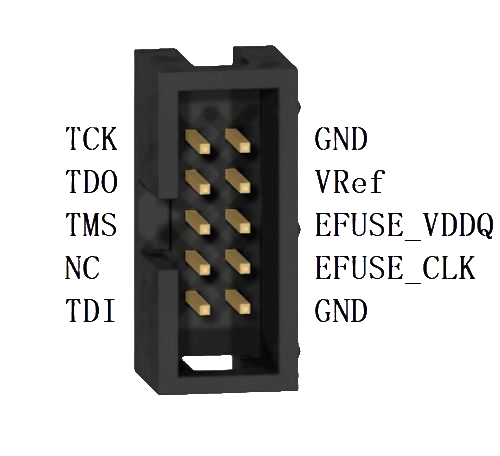

# Vllink Hercules 快速上手

Vllink Hercules是为[京微齐力](http://www.hercules-micro.com/)定制的编程、调试工具

## 调试接口定义

| 接口 | 介绍 |
| :---- | :---- |
| TCK  | JTAG时钟口 |
| TDO  | JTAG数据口 |
| TMS  | JTAG模式口 |
| NC | 未连接 |
| TDI  | JTAG数据口 |
| GND  | 共地口 |
| VRef  | 参考电压输入口 |
| EFUSE_VDDQ  | EFuse编程电压输出口 |
| EFUSE_CLK  | EFuse编程时钟输出口 |
| GND  | 共地口 |

## 模式介绍及切换
### 模式切换
* 可通过双击按键切换运行模式
* 根据编程器上电时LED闪烁次数确定当前模式

## 离线编程功能
### 简易演示
1. 将编程器连接电脑，等待出现`Vllink CFG`磁盘，若无磁盘出现，则需双击按键进入模式1
2. 修改磁盘中的`basic_config.txt`文件，如下：
    ```
    ### Vllink Basic Config ###

    # Mode=1: USBD + IF; Mode=2: USBD + AP; Mode=3: STA + IF; Mode=4: User Define;
    MODE=4

    # END
    ```
3. 修改磁盘中的`mode4_config.txt`文件，如下：
    ```
    ### Vllink Basic Mode4 Config ###

    # Mode4=disable; Mode4=enable;
    Mode4=enable

    # USBD=disable; USBD=enable;
    USBD=enable

    # CDC_Shell=disable; CDC_Shell=enable;
    CDC_Shell=enable

    # Init_CMD=<cmd>: 128bytes max;
    Init_CMD=hercules auto M7 trig_vref flash autoreset /data/top_bin.acf.bin 0x0 0x80000

    # Data1_Name=<name>: Path: /data/<name>, 32bytes max
    Data1_Name=top_bin.acf.bin

    # Data1_Size
    Data1_Size=512

    # END
    ```
4. 保存文件后，重新上电一次
5. 将M7芯片的bin固件改名为`top_bin.acf.bin`，覆盖到`/data`路径下
### 配置文件说明
#### `basic_config.txt`
* `MODE=4`：选定了模式4
#### `mode4_config.txt`
* `Mode4=enable`：启用模式4
* `USBD=enable`：启用模式4下的USB Device
* `CDC_Shell=enable`：启用模式4下的USB CDC Shell
* `Init_CMD=...`：配置模式4的上电启动命令
* `Data1_Name=top_bin.acf.bin`：在`/data`路径下生成一个bin文件，用于存储固件
* `Data1_Size=512`：指定上述bin文件的长度，此处为512KB

## 进阶资料
* [Hercules命令详解](../software/hercules.md)
