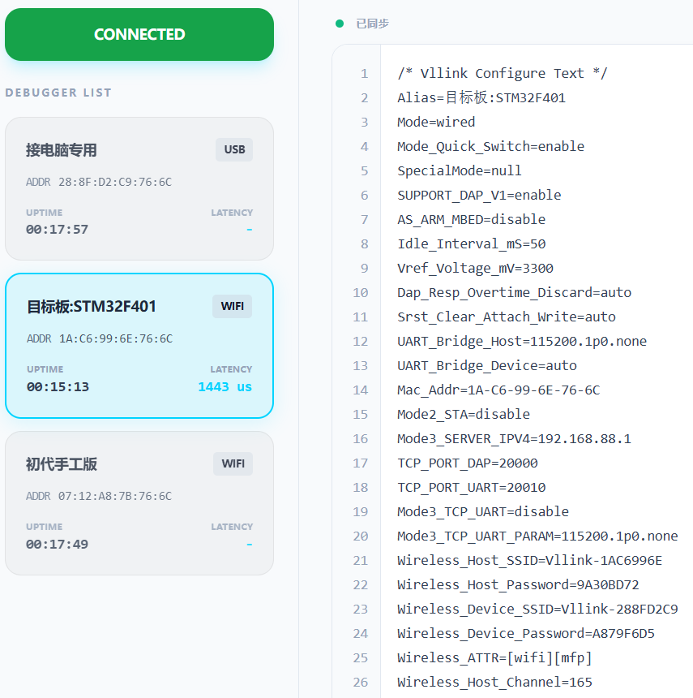

# Vllink Basic2 2026年新特性

* 前言：这次新特性开发非常顺利，但由于代码变动较大，交互机制也有改动，目前是以独立教程的形式发布，待稳定后再合并至主站。
* 固件：[V00.41-202603222246](../_static/firmware/vllink_basic2.SVCommon0041202603222246.zip)
* 全新配置工具：[Vllink 2026 Console](https://vllogic.com/_static/tools/vllink2026_console/)

## 一、综述
1. 优化Wifi及TCP机制，通讯管理更为合理，无线速率提升12%左右
2. 支持一对多，单AP最多可同时连接八个STA，最多可控制**九个目标板**（含AP所连目标板）
3. 完善`WebUSB`接口，开放 [通讯协议](../software/webusb_protocol) ，提供上位机网页工具，并 [开源](https://github.com/vllogic/vllink_console)
4. 在STA模式下增加`TCP-UART`功能，可独立作为无线TCP串口工具使用，对接任意标准TCP客户端
5. 在STA模式下增加`TCP-DAP`功能，可独立作为无线调试工具使用，对接最新版本OpenOCD

## 二、灯光机制
1. 红灯：指示是否启用USB功能
    * 常灭：关闭USB
    * 常亮：启用USB
2. 蓝灯：指示是否启用无线AP功能及无线状态
    * 常灭：关闭无线AP
    * 闪烁：启用无线AP，且未接入STA
    * 常亮：启用无线AP，且已接入STA
3. 绿灯：指示是否启用无线STA功能及无线状态
    * 常灭：关闭无线STA
    * 闪烁：启用无线STA，且未连接AP
    * 常亮：启用无线STA，且已连接AP
4. 黄灯：
    * 常灭：DC3接口未被选定
    * 闪烁：DC3接口已被选定，且VRef电压低
    * 常亮：DC3接口已被选定，且VRef电压正常
5. 蓝绿灯：
    * 注意：仅在AP模式且`Mode2_STA`被启用时出现
    * 同步闪烁：未连接路由器
    * 同步常亮：已连接路由器

## 三、按键机制
1. 双击：循环切换模式，有线模式 -> 无线AP模式（接电脑） -> 无线STA模式（接芯片）-> 有线模式 -> ...
2. 长按10秒：重置所有配置，但`VOut`以及`Vref_Voltage_mV`除外，避免误改动输出电压

## 四、一对多
* 配置工具：[Vllink 2026 Console](https://vllogic.com/_static/tools/vllink2026_console/)
#### 4.1 准备工作
* 准备多个调试器，其中一个用于连接电脑，作为AP，其余至多八个连接开发板，作为STA
* 全部升级至 [V00.41-202603222246](../_static/firmware/vllink_basic2.SVCommon0041202603222246.zip) 或更高版本固件
* 对于STA，需要通过长按重置或通过配置工具清除`Wireless_Device_SSID`与`Wireless_Device_Password`
#### 4.2 直连一对多
* 将AP连接电脑，通过双击切换到AP模式，蓝灯闪烁
* 将所需的STA上电，并接好开发板，通过双击切换到STA模式，绿灯闪烁
* 在AP与STA处于通讯距离内时，会自动完成自动配对或重连
* 只有被选定的AP或STA上所连的开发板能被电脑上的调试软件访问
* 选定方法请看 4.3 小节
#### 4.3 配置工具
* 使用浏览器打开 [Vllink 2026 Console](https://vllogic.com/_static/tools/vllink2026_console/)
* 点击`CONNECT DEVICE`，选择`DAPLink CMSIS-DAP`并连接
* 连接后，左侧是调试器卡片列表，当前选定的调试器卡片会高亮，单击卡片选定其他调试器
* 调试器卡片中会显示调试器别名、已连接时长、实时延迟
* 调试器卡片中有个`Reset`按钮，可以重启该调试器
* 右侧是功能区，目前可修改选定调试器的配置
* 一些配置说明：
    1. 配置文本修改时会高亮，同步成功后是绿色高亮
    2. `CREL + ENTER`或者光标离开编辑区会触发同步
    3. `Alias`：调试器别名，重启后生效，会显示在卡片中
    4. `Wireless_Host_SSID`：作为AP时，对外广播的`SSID`
    5. `Wireless_Host_Password`：作为AP时，配置的连接密码，默认密码会根据MAC生成，用于实现自动配对，但不适合用于高安全场景
    6. `Wireless_Device_SSID`：作为STA时，重连此`SSID`
    7. `Wireless_Device_Password`：作为STA时，重连密码
* 示例：

#### 4.4 局域网/广域网一对多
* 参看[局域网使用](../example/over_local_area_network) 与 [互联网使用](../example/over_internet)
#### 4.5 安全性说明
* 本调试器在 **有线模式** 下不会进行 **任何无线通信**
* 本调试器在 **无线模式** 下不会尝试 **与非配置IP建立任何连接**
* 本调试器在直连模式下会基于唯一MAC生成`SSID`与`PASSWORD`，此机制并非不可破解，若对安全性有要求，强烈建议统一修改`PASSWORD`后使用，修改方法如下：
    1. AP端，修改`SSID`，此项可不改：`Wireless_Host_SSID=您的SSID`
    2. AP端，修改`PASSWORD`：`Wireless_Host_Password=您的私有密码`
    3. STA端，修改`SSID`：`Wireless_Device_SSID=您的SSID`
    4. STA端，修改`PASSWORD`：`Wireless_Device_Password=您的私有密码`
* 典型场景：
    1. 研发办公室：一般视为信任区域，不需要修改，默认即可
    2. 外场：建议修改`SSID`与`PASSWORD`，消除无线特征，并对调试器进行物理防护，防止通过USB连接修改配置，进而获得您开发板的访问权

## 五、`WebUSB`接口
* TODO

## 六、`TCP-UART`
简述：配置`Wireless_Device_SSID=路由器SSID`、`Wireless_Device_SSID=路由器密码`以及`Mode3_TCP_UART=enable`，切换到模式3，在STA连上路由器后，查看STA的IP。即可通过TCP客户端连接：STA_IPv4:20010。串口参数可通过`Mode3_TCP_UART_PARAM`修改。

## 七、`TCP-DAP`
* 简述：配置`Wireless_Device_SSID=路由器SSID`、`Wireless_Device_SSID=路由器密码`，切换到模式3，在STA连上路由器后，查看STA的IP。即可通过最新版OpenOCD连接。
* [最新版OpenOCD，Windows](https://github.com/vllogic/openocd_cmsis-dap_v2/releases/tag/20260322)
* 命令：`./openocd.exe -f interface/cmsis-dap.cfg -f target/stm32f4x.cfg -c "cmsis-dap backend tcp; cmsis-dap tcp host 192.168.1.183; cmsis-dap tcp port 4441; transport select swd; adapter speed 8000"` 注意：执行命令前修改IP。
* 测试：
    ```
    > adapter speed 30000
    adapter speed: 30000 kHz
    > dump_image ram.bin 0x20000000 0x10000
    dumped 65536 bytes in 0.168065s (380.805 KiB/s)
    > load_image ram.bin 0x20000000        
    65536 bytes written at address 0x20000000
    downloaded 65536 bytes in 0.134932s (474.313 KiB/s)
    ```

## 八、后续
计划增加 **旁路总线访问** 特性。简单来讲就是网页直接读取或者写入任意地址，且不影响正在进行的调试功能。这个特性是**高性能旁路RTT**的基础。
