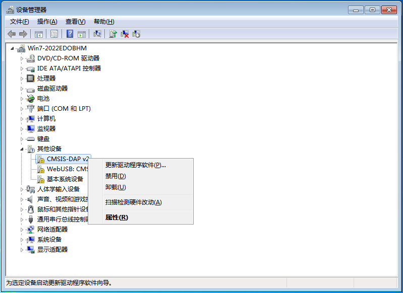
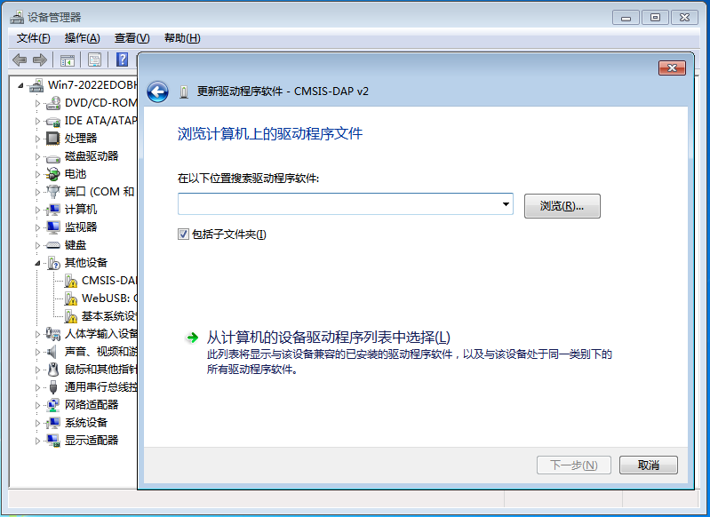
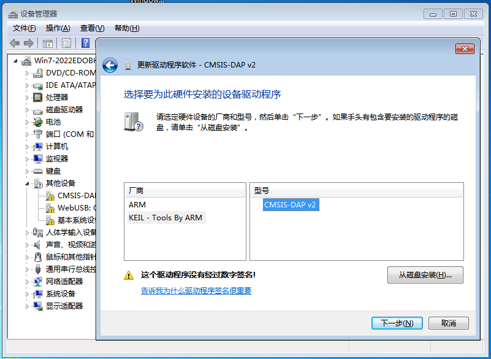
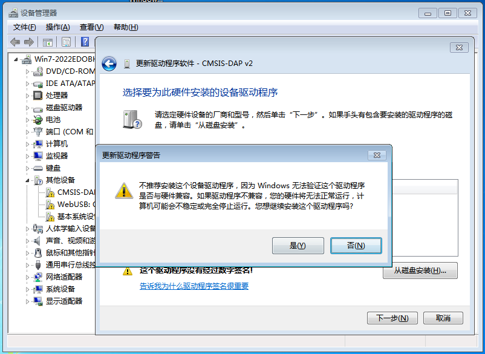
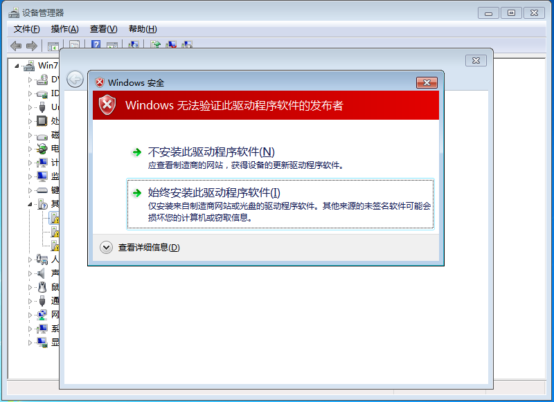

# Windows7 驱动安装
## 下载驱动
* [Vllink Windows7 Driver.zip](../_static/driver/Vllink Windows7 Driver.zip)
* 解压，文件夹中有两个inf驱动文件，稍后会用到
  
## 安装CMSIS-DAP V2驱动
1. 将DAP接上电脑，在设备管理器中出现CMSIS-DAP v2设备，右击打开操作菜单，左击`更新驱动程序软件`
   
2. 左击`浏览计算机以查找驱动程序软件`
   
3. 左击`从计算机的设备驱动程序列表中选择`
   
4. 选中`显示所有设备`，左击`下一步`
   
5. 左击`从磁盘安装`，左击`浏览`，选中压缩包解压的路径
   
6. 选中`KEIL - Tools By ARM`，选中`CMSIS-DAP v2`，左击`下一步`
   
7. 左击`是`
   
8. 若出现警告，点击`始终..`
   

## 安装CDC驱动
* 参考CMSIS-DAP V2驱动，唯一区别就是在第六步中，选中`ARM`，选中`CMSIS-DAP CDC`
   

## 所有驱动安装完成

