# Windows 驱动问题处理
* 本文旨在解决Windows系统下的驱动问题
* 典型的驱动问题有如下几种：
   1. 插入设备后，设备管理器里面出现带黄色惊叹号的接口
   2. 插入设备后，设备管理器里面出现了非预期的接口
   3. 插入设备后，设备管理器里面出现了预期的接口，软件使用却不符合预期
* 前两种情况能通过本文解决，第三种可以尝试，但问题不一定出在驱动上
* **最简单明确驱动问题的方法就是找一台系统纯净的Windows 10电脑作对比判断**

## 一、Windows 10或更高版本
### 1.1 下载Zadig及运行
* [Zadig官网](https://zadig.akeo.ie/)
* 双击打开并授权运行
* 点击`Options`，勾选`List All Devices`

### 1.2 示例：对Vllink Basic2安装CMSIS-DAP V2驱动
* 将调试器接入系统
* 如下图，找到`USB ID`为`1209 6666 00`的接口，其中1209为VID，6666为PID，00为接口号。这个接口为`CMSIS-DAP V2`，需选择`WinUSB`驱动，然后点击Replace Drvier，稍等片刻即完成安装。
   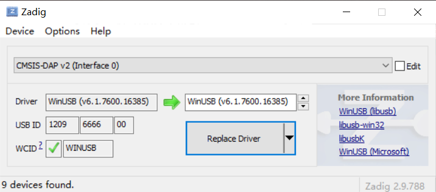
* 安装完成后，可以重插拔一次看看能否正常识别

### 1.3 设备、接口及驱动类型的对应关系
* 根据下表所列对应关系，可以修复所有接口的驱动问题
   | 设备 | VID | PID | 接口号 | 接口名 | 适用驱动 | 接口用途 |
   | :---- | :----: | :----: | :----: | :----: | :----: | :----: |
   | Vllink Basic2（含2X） | 1209 | 6666 | 0 | CMSIS-DAP V2 | `WinUSB` | 调试 |
   | Vllink Basic2（含2X） | 1209 | 6666 | 1 | WebUSB | `WinUSB` | 配置 |
   | Vllink Basic2（含2X） | 1209 | 6666 | 2 | CDC | `USB Serial(CDC)` | 串口 |
   | Vllink Basic2（含2X） | 1209 | 6666 | 4 | CMSIS-DAP V1 | 不支持 | 调试 |
   | Vllink Box（含Box2） | 1209 | 6666 | 0 | CMSIS-DAP V2 | `WinUSB` | 调试 |
   | Vllink Box（含Box2） | 1209 | 6666 | 1 | WebUSB | `WinUSB` | 预留 |
   | Vllink Box（含Box2） | 1209 | 6666 | 2 | CDC | `USB Serial(CDC)` | 串口 |
   | Vllink Box（含Box2） | 1209 | 6666 | 4 | CMSIS-DAP V1 | 不支持 | 调试 |
   | Vllink Basic | 1209 | 6666 | 0 | CMSIS-DAP V2 | `WinUSB` | 调试 |
   | Vllink Basic | 1209 | 6666 | 2 | CDC | `USB Serial(CDC)` | 串口 |
   | Vllink Basic | 1209 | 6666 | 3 | MSC | 不支持 | 配置用磁盘 |
* 若设备配置了`AS_ARM_MBED=enable`，VID / PID 将变成 `0D28 / 0204`，接口号及适用驱动不变
* 表中`CMSIS-DAP V1`与`MSC`都是系统默认驱动，不要用`Zadig`修改
* 使用`Zadig`安装驱动**务必慎重**，错误安装驱动会浪费很多时间

## 二、Window 7下安装CMSIS-DAP V2及CDC驱动
### 2.1 下载驱动
* [Vllink Windows7 Driver.zip](../_static/driver/Vllink_Windows7_Driver.zip)
* 解压，文件夹中有两个inf驱动文件，稍后会用到

### 2.2 安装CMSIS-DAP V2驱动
* 将DAP接上电脑，在设备管理器中出现CMSIS-DAP v2设备，右击打开操作菜单，左击`更新驱动程序软件`
   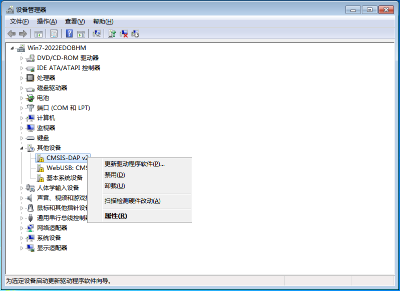
* 左击`浏览计算机以查找驱动程序软件`
   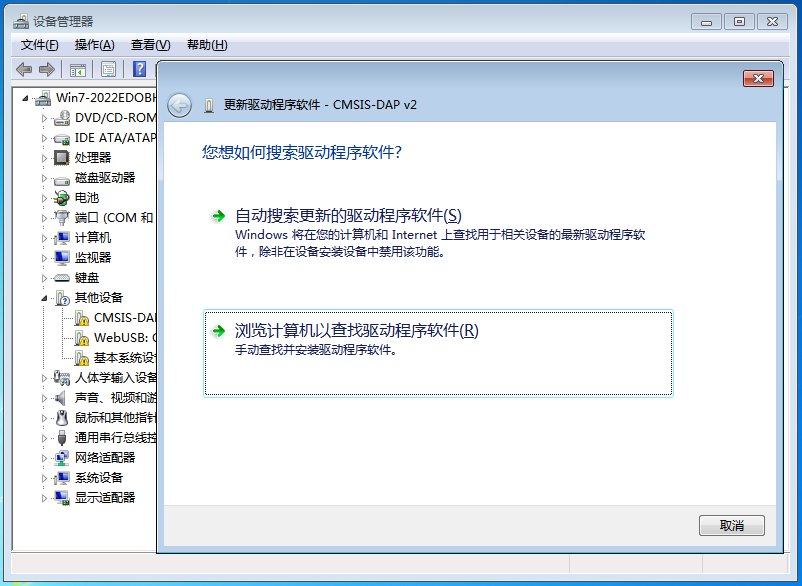
* 左击`从计算机的设备驱动程序列表中选择`
   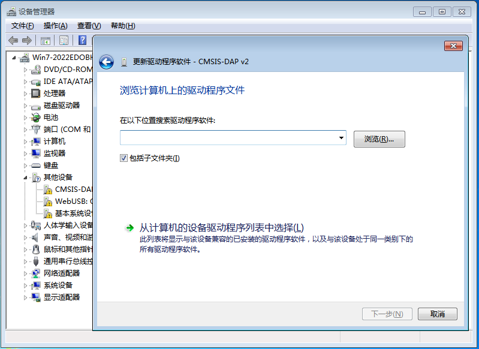
* 选中`显示所有设备`，左击`下一步`
   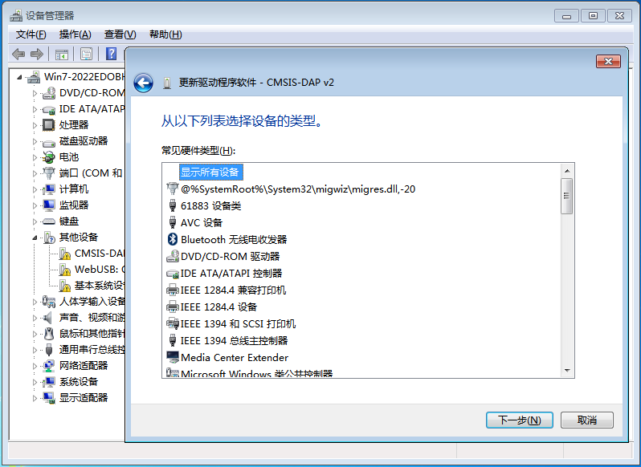
* 左击`从磁盘安装`，左击`浏览`，选中压缩包解压的路径
   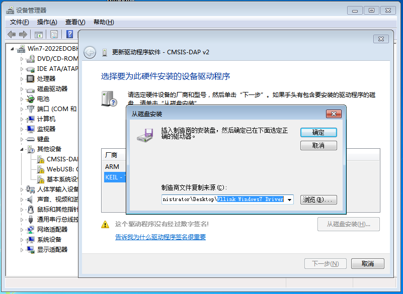
* 选中`KEIL - Tools By ARM`，选中`CMSIS-DAP v2`，左击`下一步`
   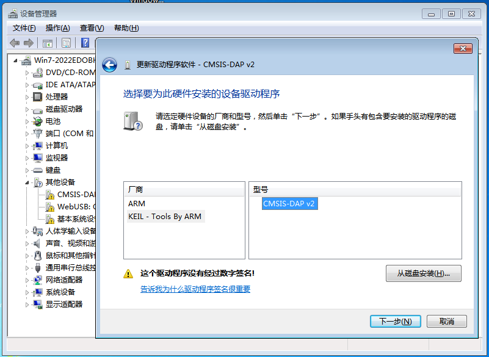
* 左击`是`
   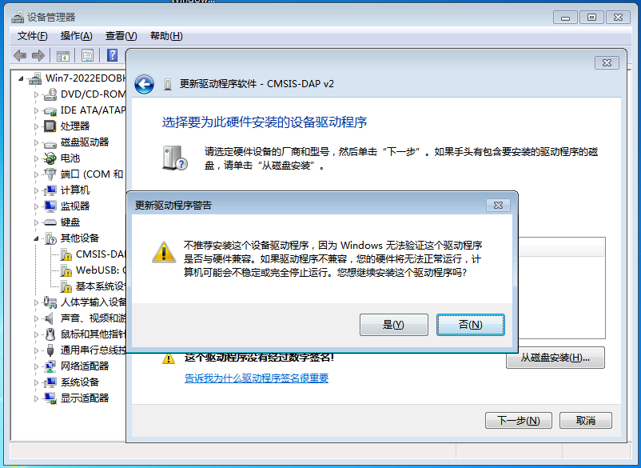
* 若出现警告，点击`始终..`
   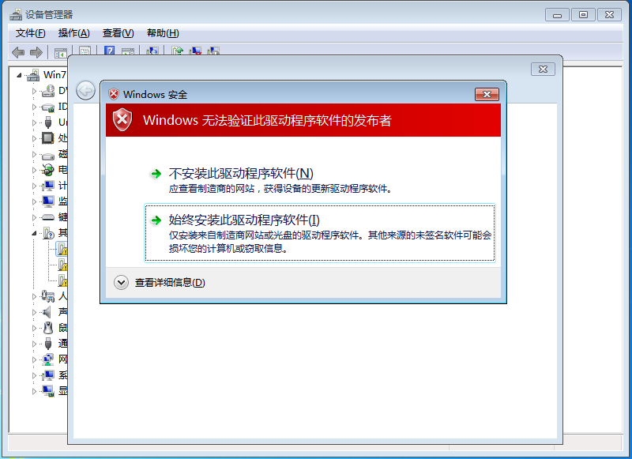

### 2.3 安装CDC驱动
* 参考安装CMSIS-DAP V2驱动过程，在设备管理器中选中设备`Vllink-CDCExt`
   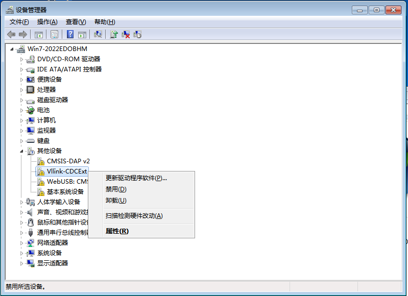
* 在第六步中，选中`ARM`，选中`CMSIS-DAP CDC`
   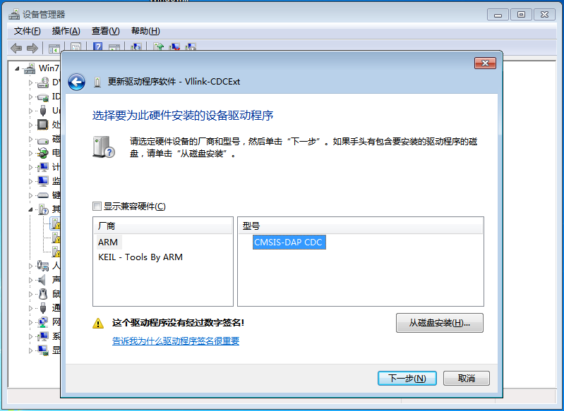

### 2.4 安装完成
* 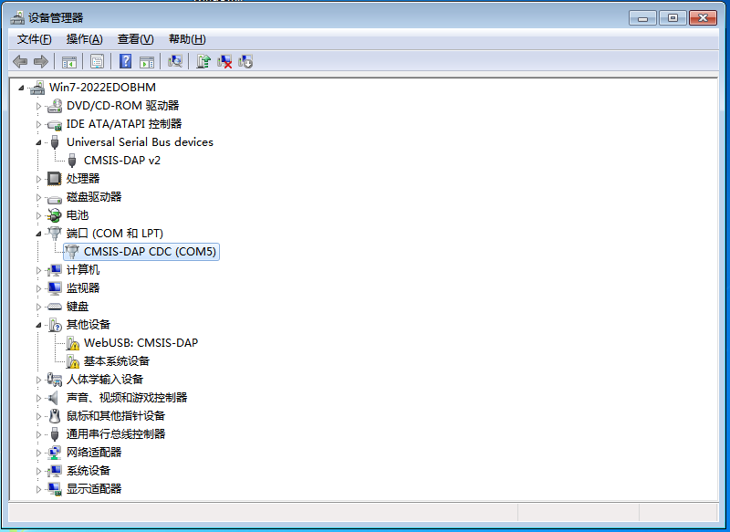
